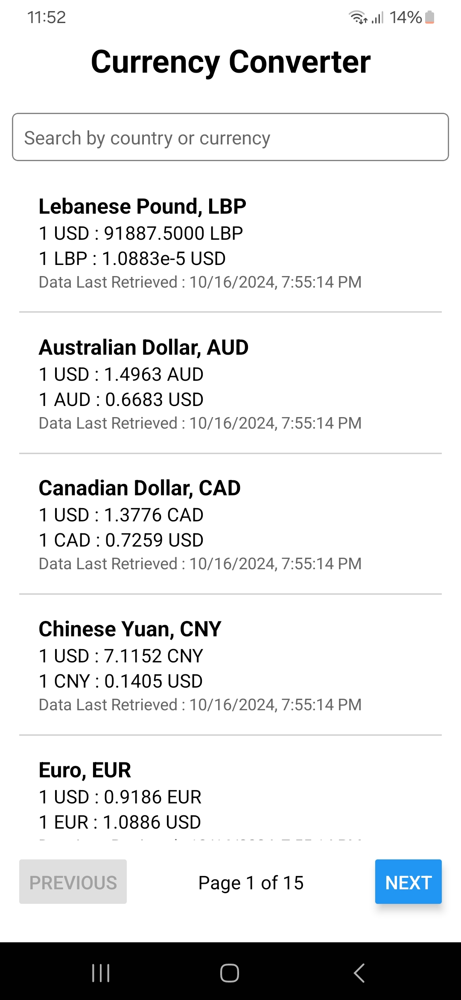

# Currency Converter App

A **React Native** application made with **Expo** that fetches and displays currency exchange rates. It allows users to search for specific currencies and view the rates with pagination.

## Features

- Fetches live currency exchange rates every 10 seconds.
- Search for currencies by country or currency code.
- Pagination for displaying rates.
- Loading indicator to inform users while fetching data.
- Built using Expo for easier setup and development.

## Technologies Used

- React Native
- Expo
- Axios for API calls
- AsyncStorage for persistent state
- Zustand for state management
- Yarn for package management

## Installation

1. **Clone the repository:**

   ```bash
   git clone https://github.com/Rancha124/CurrencyConverter
   cd CurrencyConverter
   ```

2. **Install dependencies using Yarn:**

   ```bash
   yarn install
   ```

3. **Start the Expo development server:**

   ```bash
   yarn start
   ```

4. **Open the app on your device:**

   ```bash
   Scan the QR code generated by Expo on your phone using the Expo Go app.
   Or, open the app in an emulator (iOS/Android).
   ```

## Screenshots

### Home Screen

<p>
  
</p>

### Home Screen With Search

<p>
  
</p>

## Demo

[Watch the App Demo on YouTube](https://youtu.be/dP9xLAE7TM0)
